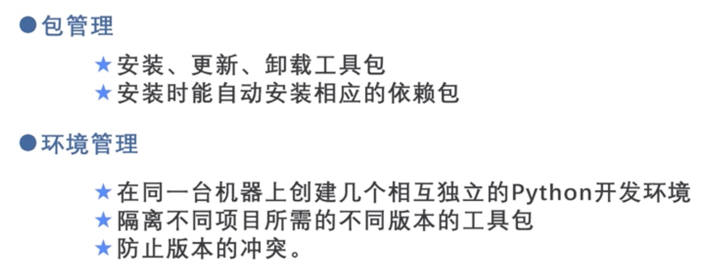

# 1.起源

图灵完备/图灵等价 ：能够解决所有在算法上可计算的问题

图灵测试应用：

- 验证码：来区分人机

## 2.创建环境

使用环境：Python3.8+anaconda3+TensorFlow2.0

电脑环境：MacOS 10.14	 

##### 1.安装anaconda3

- 国内推荐选用清华镜像：https://mirrors.tuna.tsinghua.edu.cn/anaconda/archive/

- 下载安装后访问终端：`vim ~/.bash_profile`

- ```bash
  # 查看是否有此配置环境
  # >>> conda initialize >>>
  # !! Contents within this block are managed by 'conda init' !!
  __conda_setup="$('/Users/tanjing/opt/anaconda3/bin/conda' 'shell.bash' 'hook' 2> /dev/null)"
  if [ $? -eq 0 ]; then
      eval "$__conda_setup"
  else
      if [ -f "/Users/tanjing/opt/anaconda3/etc/profile.d/conda.sh" ]; then
          . "/Users/tanjing/opt/anaconda3/etc/profile.d/conda.sh"
      else
          export PATH="/Users/tanjing/opt/anaconda3/bin:$PATH"
      fi
  fi
  unset __conda_setup
  # <<< conda initialize <<<	
  ```

  如果有，退出后输入`source ~/.bash_profile`后，输入`conda --version`进行检验是否安装成功

##### 2.使用Jupyter Notebook

- 优点
  - 能够通过Web进行程序的编写与运行
  - 屏蔽了不同系统的显示差异，便于程序的远程访问和代码共享
  - 可以将程序和文档整合与同一个文档之中
- 修改默认目录
  - 创建默认目录：`jupyter notebook --generate-config`
  - 使用VSCode打开路径，寻找`c.NotebookApp.notebook_dir=“”`修改为目标路径，即可访问指定文件夹
- 创建新文件,文件格式为.ipynb：
  - 每一个cell即为一个模块，可以选择为code模式 /md模式进行编写，点击运行即可出现结果

##### 3.包管理和环境管理

- 优缺点：	

  

- 包管理语法：

  - conda命令：

    - 安装包 `conda install <包名称列表> `

    - 卸载包 `conda remove <包名称列表> `

    - 更新包 `conda update <包名称列表> `

    - 搜索包 `conda search <搜索项> `

    - 查看所有包 `conda list `

    - 升级包版本 `conda update <包名称>`

    - 在下载源地址中添加清华大学开源软件镜像站 2.5包管理和环境管理 

      `conda config --add channels https://mirrors.tuna.tsinghua.edu.cn/anaconda/pkgs/free/`

  - pip命令：

    - 安装包 `pip install <包名称列表> `
    - 卸载包 `pip uninstall <表名称列表>`
    - ⚠️指定版本时需要使用双等号 `== `

- 环境管理语法：

  - 创建/删除环境(create/remove)

    ```bash
    #创建
    conda create env --name <环境名称> <包名称列表>
    conda create --name <环境名称> <包名称列表>
    conda create env -n <环境名称> <包名称列表>
    conda create -n <环境名称> <工具包列表>
    
    conda create -n py2 python=2.7 pandas
    conda create --name py3 python=3.7
    #删除
    conda env remove --name <环境名称> --all
    conda remove --name <环境名称> --all
    conda env remove -n <环境名称> --all
    conda remove 
    ```

  - 激活/退出当前环境(activate/deactivate)：

    ```bash
    source activate <环境名称>
    source deactivate <环境名称>
    ```

  - 显示当前环境

    ```bash
    conda env list
    ```

  - 导出环境

    ```bash
    conda env export > environment.yml
    ```

  - 配置环境

    ```bash
    conda env creat -f environment.yml
    ```

##### 5.安装tensorflow2.0

🔗参考链接：`https://blog.csdn.net/weixin_41515197/article/details/112726989`

- 输入`conda --version`可以看到版本信息。

- 更换镜像的教程时他提供的命令是(不要用这条命令)：

  ```bash
  #修改镜像
  #/free已经不更新,可以使用第二条连接
  conda config --add channels https://mirrors.tuna.tsinghua.edu.cn/anaconda/pkgs/free/
  conda config --add channels https://mirrors.tuna.tsinghua.edu.cn/anaconda/pkgs/main/
  
  conda config --set show_channel_urls yes
  
  #创建环境,此条命令可以在anaconda的UI界面中创建,python版本可以选择
  conda create --name tensorflow python=3.7
  ```

- 安装完成后激活环境并安装

  ```bash
  #激活
  conda activate tensorflow
  #安装tensorFlow,地址可以在清华镜像中选择想要的版本
  #https://mirrors.tuna.tsinghua.edu.cn/pypi/web/simple/tensorflow/
  pip install --ignore-installed --upgrade 地址
  #关闭
  conda deactive

- 安装成功后<u>**进入`python`**</u>进行验证

  ```bash 
  #验证方法1:结果是你安装的tensorflow的版本号，说明安装成功了
  >>> import tensorflow as tf
  >>> tf.__version__
  #验证方法2:适用于2.0以下版本，输出正确语句即成功
  >>> import tensorflow as tf
  >>> hello = tf.constant('Hello, TensorFlow!')
  >>> sess = tf.Session()
  >>> print(sess.run(hello))
  Hello,TensorFlow!
  #验证方法3:适用于2.0及以上版本
  >>> import tensorflow as tf
  >>> tf.compat.v1.disable_eager_execution()
  >>> hello=tf.constant(‘Hello,Tensorflow!’)
  >>> sess=tf.compat.v1.Session()
  >>> print(sess.run(hello))
  Hello,Tensorflow!
  ```
